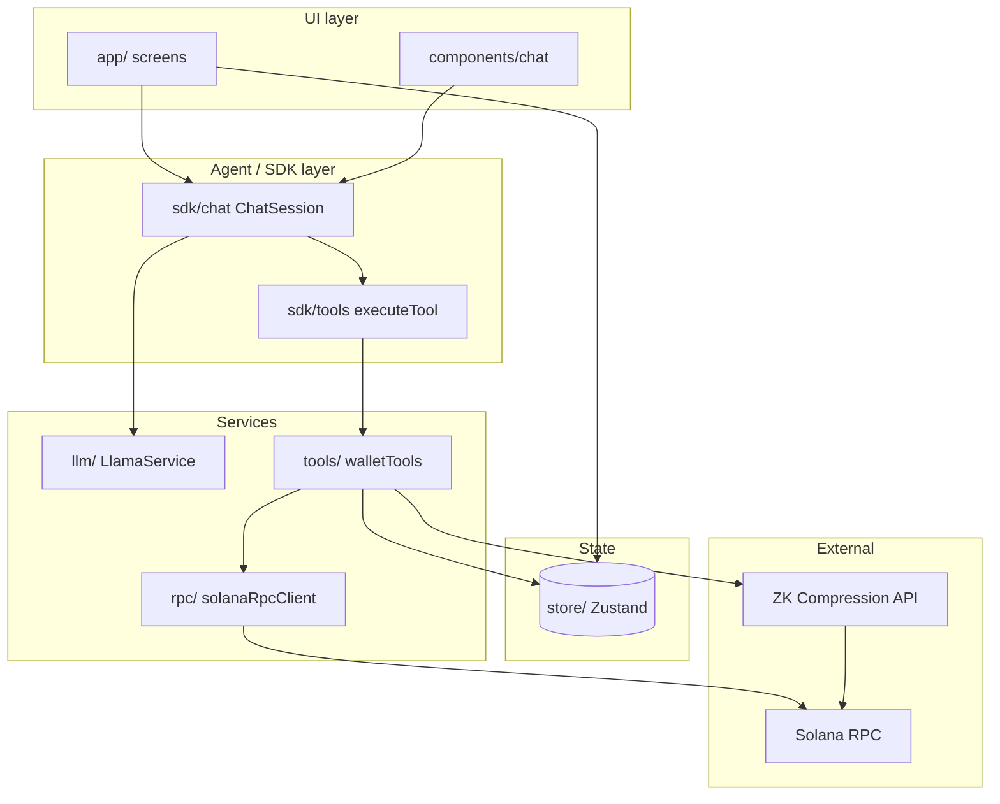

# GhostWallet

AI-powered privacy wallet: Solana wallet with on-device AI (llama.rn) and conversational tools for balance, send, shield, and private send.

**Solana Privacy Hack** — GhostWallet is an agentic privacy wallet with on-device LLM, ZK Compression (shielded balance / private send), and MCP-style tools in chat. See **[MILESTONE.md](./MILESTONE.md)** for scope and deliverables.

## Features

✅ **Wallet** – Send / receive SOL, private send (compressed SOL), address book, shielded (ZK Compression) balance  
✅ **100% On-Device AI** – No internet required after model download  
✅ **Real-time streaming** – Token-by-token responses  
✅ **Wallet tools in chat** – Ask for balance, send SOL, shield funds, private send; tools use the same data as the Wallet screen  
✅ **Model management** – Download and switch models in Settings  
✅ **Chat history** – Persistent conversations  
✅ **Dark mode** – Supported across app  
✅ **GPU acceleration** – OpenCL on Android

## Privacy

GhostWallet is designed to be **privacy-oriented** end to end:

- **On-device AI** — The LLM runs locally (llama.rn). Your chat and wallet-related prompts never leave the device; no third-party AI service sees your messages or balance.
- **Keys stay on device** — Wallet keys (and optional recovery phrase) are stored locally. There is no central sign-up or server-held keys; you own the keys.
- **Shielded balance & private send** — ZK Compression lets you hold and move SOL in a **shielded** form (compressed accounts). You can “shield” public SOL into private SOL and use **private send** so transfers don’t expose amounts or full history on the public chain in the same way as plain transfers.
- **You choose the RPC** — For devnet, you set your own ZK-capable RPC (e.g. Helius) in `.env`. The RPC can see address and balance queries you make to it; using your own API key lets you control and reason about that provider.
- **Local-only data** — Chat history and address book are stored on the device (e.g. AsyncStorage). No mandatory cloud sync or account linking for wallet or chat.

So: **no cloud AI, no server-held keys, optional shielded SOL flows, and local-first data** make the app privacy-oriented by design.

## Quick Start

### 1. Install Dependencies

```bash
bun install
```

### 2. Generate Native Projects

```bash
bun run prebuild
```

This will generate iOS and Android native projects with llama.rn configured.

### 3. Run the App

**iOS:**

```bash
bun run ios
```

**Android:**

```bash
bun run android
```

## First-Time Setup

1. **Launch the app** and navigate to the "AI Chat" tab
2. **Tap "Select Model"** to go to AI Settings
3. **Choose a model** to download:
   - **Ghost AI** (Recommended) – ~514 MB, fast base model
   - **Ghost AI Pro** – ~696 MB, instruct model
   - **Ghost AI Ultra (Experimental)** – ~696 MB, reasoning / chain-of-thought
4. **Wait for download** to complete (progress shown)
5. **Start chatting!** The model runs 100% on your device

## Available Models

| Model                          | Size     | Description                                        |
| ------------------------------ | -------- | -------------------------------------------------- |
| Ghost AI                       | ~514 MB  | Fast responses. Base model, quick replies.         |
| Ghost AI Pro                   | ~696 MB  | Instruct model. Smarter responses.                 |
| Ghost AI Ultra (Experimental)  | ~696 MB  | Experimental reasoning / chain-of-thought model.   |

## Installation (release builds)

Pre-built **APK** (Android) and **IPA** (iOS) are attached to [GitHub Releases](https://github.com/imortaltatsu/ghost_wallet/releases) (e.g. **milestone-2**). Download and install as follows.

### Android (APK)

1. Download **app-release.apk** from the [latest release](https://github.com/imortaltatsu/ghost_wallet/releases).
2. On your device: **Settings → Security** (or **Apps**) → enable **Install unknown apps** for your browser or file manager.
3. Open the downloaded APK and confirm install.

Alternatively, with [ADB](https://developer.android.com/studio/command-line/adb):  
`adb install app-release.apk`

### iOS (IPA)

We recommend **[iLoader](https://iloader.site/)** to install the IPA on your iPhone or iPad without Xcode:

1. **On your computer:** Download [iLoader](https://iloader.site/) (Windows, macOS, or Linux) and install it.
2. **On your iPhone/iPad:** Enable **Developer Mode** (Settings → Privacy & Security → Developer Mode) if you’re on iOS 16 or later.
3. Connect the device via USB, open iLoader, sign in with your Apple ID, then drag and drop **GhostWallet.ipa** (downloaded from the release) or use iLoader’s install flow to sideload the app.

iLoader is open-source and supports sideloading IPA files without a Mac or Xcode. See [iLoader](https://iloader.site/) and [GitHub – nab138/iloader](https://github.com/nab138/iloader) for details and updates.

**Alternative:** Install via Xcode (Window → Devices and Simulators → select device → add the IPA) or Apple Configurator if you have them.

---

## Building release builds

- **Android APK:** `bun run android:apk` → `android/app/build/outputs/apk/release/app-release.apk`
- **iOS IPA:** `bun run buildipa` (macOS + Xcode; sets up `ios/` and ExportOptions if needed; first run: set your teamID in `ios/ExportOptions.plist` then run again)

See **[BUILD.md](./BUILD.md)** for details (Android SDK, iOS teamID/export options, production signing).

## Architecture

GhostWallet is a React Native (Expo) app with three main layers: **UI** (screens and chat), **agent layer** (chat session + tools + LLM), and **wallet/chain** (Solana RPC, ZK Compression). All wallet-related tools use the same stores as the Wallet UI so balance and actions stay consistent.

### High-level flow


1. **User** talks in AI Chat or uses Wallet screens (Send, Receive, Shielded, Private send).
2. **Chat path:** User message → `ChatSession` (SDK) → prompt + tool definitions → **LlamaService** (on-device LLM) → streamed tokens; when the model calls a tool, **ToolRegistry** runs the handler (e.g. `walletTools`) → result is formatted and appended to the conversation.
3. **Wallet path:** Screens read from **walletStore**, **compressedStore** / **shieldedStore**, **addressBookStore**; actions (send, shield, private send) call the same stores and RPC/compression services that the chat tools use.
4. **RPC:** Devnet uses a single Helius (or ZK-capable) URL when set (`constants/network.ts`); wallet and ZK compression share it so `getSlot` and compressed balance work in debug and release.

### Layer stack



### Layers

| Layer | Role |
|-------|------|
| **app/** | Screens: home (chat), wallet (send, receive, private-send, address-book, shielded), settings (AI, theme, network, wallet backup). |
| **components/chat/** | Chat UI: `ChatContainer`, `MessageBubble`, `ChatInput`, `LlmOutputRenderer` (streaming). |
| **sdk/chat/** | `ChatSession`: turns history + tools into ChatML, runs LLM, handles tool calls and response formatting. |
| **sdk/tools/** | Tool registration, `getToolsForChatML`, `executeTool` (dispatches to wallet/MCP tools). |
| **services/llm/** | `LlamaService` (llama.rn), `textGenerator`; loads GGUF, runs inference on device. |
| **services/tools/** | `walletTools`: get_balance, get_private_balance, send_sol, shield_funds, private_send, get_contacts; use `walletBalanceData` and wallet/compressed stores. |
| **services/mcp/** | Loads MCP tool definitions (JSON) for chat. |
| **services/rpc/** | Solana RPC client (connection from settings store). |
| **store/** | Zustand: `walletStore`, `compressedStore`, `shieldedStore`, `walletBalanceData`, `chatStore`, `llmStore`, `addressBookStore`, `settingsStore`. Single source of truth for balance and wallet state. |
| **constants/** | `network.ts` (RPC URLs, Helius for ZK), `Models.ts` (model list), theme. |
| **utils/** | `chatTemplate`, `chatml`, `modelDownloader`, `polyfills`. |

### Project layout

```
ghostwallet/
├── app/                    # Screens (Expo Router)
│   ├── index.tsx, _layout.tsx, modal.tsx
│   ├── settings/ai-settings.tsx
│   └── wallet/             # send, receive, private-send, address-book, shielded
├── components/chat/         # ChatContainer, MessageBubble, ChatInput, LlmOutputRenderer
├── sdk/
│   ├── chat/               # ChatSession (prompt + tools + tool response formatting)
│   └── tools/              # getToolsForChatML, executeTool
├── services/
│   ├── llm/                 # LlamaService, textGenerator (llama.rn)
│   ├── tools/               # walletTools (get_balance, send_sol, shield_funds, etc.)
│   ├── mcp/loadMCP.ts       # MCP tool definitions
│   └── rpc/                 # solanaRpcClient
├── store/                   # Zustand: wallet, compressed, shielded, chat, llm, addressBook, settings
├── constants/               # network (RPC), Models, theme
├── mcp/tools/               # JSON tool defs (get_balance, send_sol, …)
├── utils/                   # chatTemplate, modelDownloader, polyfills
├── BUILD.md                 # Build & release (APK, IPA)
└── MILESTONE.md             # Scope & deliverables
```

## Configuration

### Model Settings

Edit model parameters in AI Settings:

- **Temperature** (0.0-1.0): Controls randomness
- **Context Size**: Maximum conversation history
- **GPU Layers**: Number of layers on GPU (99 = all)

### Default Configuration

```typescript
{
  contextSize: 2048,
  temperature: 0.7,
  topP: 0.9,
  topK: 40,
  repeatPenalty: 1.1,
  nGpuLayers: 99,
  nPredict: 512,
}
```

## Wallet tools in chat

The AI can use MCP-style tools (see `services/tools/walletTools.ts` and `mcp/tools/*.json`):

- **get_balance** – Total, public, and shielded SOL (same source as Wallet screen)
- **get_private_balance** – Shielded (compressed) balance only
- **send_sol** – Send public SOL
- **shield_funds** – Convert public SOL to shielded (compressed)
- **private_send** – Send shielded SOL
- **get_contacts** – List address book

Balance data comes from `store/walletBalanceData.ts` (synced with `shieldedStore` for shielded balance).

## Performance Tips

1. **Release builds** (APK/IPA) are much faster than dev builds; use them for demos and testing.
2. **Start with smaller models** (Ghost AI) for testing.
3. **Enable GPU acceleration** (default: 99 layers).
4. **Adjust context size** based on device memory.
5. **Clear chat history** periodically to free memory.

## Troubleshooting

### Helius RPC (required for ZK / private balance)

The app uses **Helius** (or another ZK-capable RPC) for devnet when configured: both wallet RPC and ZK compression use the same URL so `getSlot`, shielded balance, and private send work. Set in `.env`:

```
EXPO_PUBLIC_COMPRESSION_API_URL=https://devnet.helius-rpc.com?api-key=YOUR_KEY
```

- **Debug:** Metro/Expo load `.env`; or set the env when starting.
- **Release:** Rebuild from project root so `app.config.js` bakes the URL into the app (IPA: `bun run buildipa`; APK: `bun run android:apk`).

Do **not** commit `.env` (it’s in `.gitignore`). See [Helius ZK Compression](https://www.helius.dev/docs/api-reference/zk-compression).

### Private / shielded: "method not found" or "failed to get a slot" in release

Same as above: set `EXPO_PUBLIC_COMPRESSION_API_URL` in `.env` and rebuild the release from the project root.

### Model won't download

- Check available storage space
- Ensure stable internet connection
- Try downloading a smaller model first

### App crashes during inference

- Reduce context size (try 1024 instead of 2048)
- Reduce GPU layers (try 20 instead of 99)
- Use a smaller model

### Slow generation

- Increase GPU layers for better acceleration
- Close other apps to free memory
- Consider using a smaller model

## Development

### Clean Rebuild

```bash
bun run prebuild:clean
```

### Add New Dependencies

```bash
bun add <package-name>
# or
expo install <package-name>
```

## Tech Stack

- **Expo SDK 54** – React Native framework
- **Solana** – `@solana/web3.js`, `@solana/client` for RPC and wallet
- **Light Protocol SDK** – `@lightprotocol/compressed-token`, `@lightprotocol/stateless.js` for ZK Compression (shielded balance, private send)
- **llama.rn** – On-device LLM inference
- **Zustand** – State management
- **React Native FS** – File system access
- **AsyncStorage** – Persistent storage
- **Markdown Display** – Rich text rendering

## License

MIT

## Credits

- **Light Protocol** – privacy infrastructure (ZK Compression, shielded balance)
- **llama.rn** by [@mybigday](https://github.com/mybigday/llama.rn)
- **LiquidAI** base models